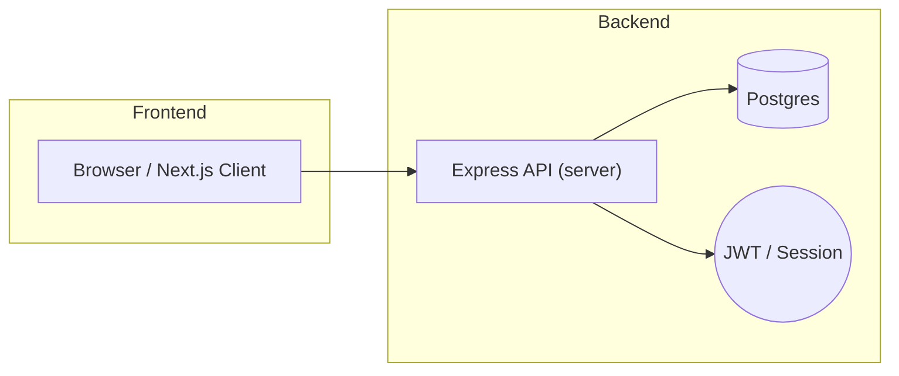

# PrimeTrade - Frontend + Backend

Professional README: how to run, architecture, data flow, and developer guide.

---

## Project Overview

This repository contains a simple task management app split into two main parts:

- `client/` — Next.js (App Router) frontend written in TypeScript and React. Uses `sonner` for toasts and a component library under `client/components/ui`.
- `server/` — Express + TypeScript backend with Prisma for database access. Exposes a REST API under `/api/v1` (routes defined in `server/src/api/v1`).

The project is prepared to run with Docker Compose (development-friendly configuration provided at `docker-compose.yaml`).

---

## Architecture (High level)

- Browser / Client (Next.js)
  - Renders UI, calls backend API for auth, profile and tasks.
  - Environment: `NEXT_PUBLIC_API_URL` points to backend (e.g. `http://localhost:4000/api/v1`).
- Backend (Express)
  - REST API (routes under `server/src/api/v1`): auth, user/profile, tasks.
  - Uses Prisma to connect to a database (Postgres recommended) via `DATABASE_URL`.
  - JWT auth and secure cookies for session handling.

Mermaid architecture diagram:



---

## Data Flow

1. User interacts with the UI (create/update/delete tasks, update profile, login/signup).
2. Client calls backend endpoints (e.g., `POST /tasks/create`, `DELETE /tasks/delete`).
3. Backend validates requests, checks authentication, and calls services (e.g., `task.service.ts`) which use Prisma to query/update the database.
4. Backend returns a standardized JSON response. Frontend displays success/error using the toast component (`sonner`) and updates UI state accordingly.

---

## Quick Start (Docker Compose)

These steps will run the `server` and `client` containers defined in `docker-compose.yaml`.

Prerequisites: Docker and Docker Compose installed.

1. Copy server environment file and set secrets:

```bash
cp server/.env.example server/.env
# Edit server/.env and set DATABASE_URL, JWT_SECRET, FRONTEND_URL, etc.
```

2. Start services:

```bash
docker compose up --build
```

3. Visit the frontend at http://localhost:3000 and the backend API at http://localhost:4000/api/v1

To stop and remove containers:

```bash
docker compose down
```

Notes: the provided `docker-compose.yaml` starts `server` and `client`. It does not start a database container — you can either point `DATABASE_URL` at a managed DB, or add a `postgres` service to the compose file.

Example `DATABASE_URL` for local Postgres container:

```text
postgresql://postgres:postgres@db:5432/primetrade?schema=public
```

---

## Running locally (without Docker)

Requirements: Node.js (>=16), pnpm, and a Postgres database (or other database supported by Prisma and configured by `DATABASE_URL`).

Server

```bash
cd server
pnpm install
# create/update server/.env with DATABASE_URL, JWT_SECRET, FRONTEND_URL
pnpm dev
```

Frontend

```bash
cd client
pnpm install
# set NEXT_PUBLIC_API_URL env var, for example: NEXT_PUBLIC_API_URL=http://localhost:4000/api/v1
pnpm dev
```

---

## Environment variables

Server (`server/.env`):

- `PORT` (default 4000)
- `NODE_ENV` (development|production|test)
- `FRONTEND_URL` (e.g. http://localhost:3000)
- `DATABASE_URL` (Prisma connection URL)
- `JWT_SECRET` (secret used for signing tokens)
- `USE_HTTPS` (optional)

Client (`client/.env` or passed to build):

- `NEXT_PUBLIC_API_URL` (e.g. `http://localhost:4000/api/v1`)

---

## API Endpoints (overview)

Main routes (prefix `/api/v1` when calling the server directly — the client library uses `NEXT_PUBLIC_API_URL`):

- Auth
  - `POST /auth/signup` — register
  - `POST /auth/login` — login
  - `POST /auth/logout` — logout
- Profile / User
  - `GET /profile` — get current user profile
  - `PUT /profile/update` — update profile (body: { username, email })
- Tasks
  - `POST /tasks/create` — create task
  - `GET /tasks` — get user tasks
  - `GET /tasks/:id` — get task by id
  - `PUT /tasks/update/:id` — update task
  - `DELETE /tasks/delete/:id` — delete single task
  - `DELETE /tasks/delete` — bulk delete (body: { ids: string[] })

For full route definitions see `server/src/api/v1`.

---

## Database / Prisma

This project uses Prisma as the ORM. The schema is in `server/prisma/schema.prisma`.

To run migrations / generate client locally:

```bash
cd server
pnpm prisma generate
pnpm prisma migrate dev --name init
```

If you need to reset a development DB (danger: destructive):

```bash
pnpm prisma migrate reset
```

---

## Development notes & tips

- Use `pnpm` as package manager (workspaces are configured).
- Frontend: `client/app` uses Next.js App Router. Components are under `client/components`.
- Backend: controllers in `server/src/controllers`, services in `server/src/services`, routes in `server/src/api/v1`.
- API client helper: `client/lib/fetcher.ts` centralizes axios requests and uses `API` map defined in `client/lib/api.ts`.

---

## Troubleshooting

- If the frontend cannot reach the backend, verify `NEXT_PUBLIC_API_URL` and that `server` is reachable (CORS/ports).
- Database connection errors: verify `DATABASE_URL`, that the DB is reachable, and run `pnpm prisma generate`.
- If JWT/Authentication fails, ensure `JWT_SECRET` is set and consistent across environments.

---

## Contributing

1. Fork the repo
2. Create a feature branch
3. Open a PR with tests or a demo

---

If you want, I can also:

- Add a `docker-compose.postgres.yml` that includes Postgres for local development.
- Export an environment file for Postman with `base_url` set.
- Render and attach the Mermaid diagram as an image.

---

Thank you — if you'd like changes to the README format or more details (healthchecks, metrics, CI), tell me what to include.
