# PrimeTrade Task Management App

This repository contains a full-stack task management application developed as part of a Frontend Developer technical assessment.

---

## 🌐 Live Demo

- Frontend: https://primetrade-assignment-task.vercel.app
- Backend API: https://primetrade-assignment-task.onrender.com

> ⚠️ Heads up: The backend is hosted on Render’s free plan. The first request might take a few seconds while the server “wakes up.” Thanks for your patience!

---

## 🛠 Tech Stack

**Frontend:**

- Next.js 16 (App Router)
- React + TypeScript
- TailwindCSS
- shadcn/ui
- Protected routes
- react-hook-form
- Zod

**Backend:**

- Node.js + Express
- TypeScript
- Prisma ORM
- PostgreSQL (Neon)
- JWT Authentication
- bcrypt password hashing
- Zod

**DevOps:**

- Docker + Docker Compose
- Render deployment

---

## 🛠️ Request/Data Flow

```mermaid
sequenceDiagram
    participant FE as Frontend
    participant API as API (HTTP)
    participant AUTH as Auth Middleware
    participant ROUTE as Route Handler
    participant VAL as Validation Middleware
    participant CTRL as Controller
    participant SVC as Service
    participant REP as Repository (Prisma)
    participant DB as Database
    participant ERR as Error Handler

    FE->>API: Client-side validation → send request
    API->>AUTH: Verify JWT / auth headers
    AUTH-->>API: Auth OK / 401
    AUTH->>ROUTE: Forward to route handler
    ROUTE->>VAL: Validate request schema
    VAL-->>ROUTE: Valid / 400
    ROUTE->>CTRL: Call controller
    CTRL->>SVC: Execute business logic
    SVC->>REP: Repository (Prisma) operations
    REP->>DB: Query / update
    DB-->>REP: Result
    REP-->>SVC: Return data
    SVC-->>CTRL: Service result
    CTRL-->>API: Response payload
    API-->>FE: Send response

    %% Error paths
    AUTH->>ERR: Unauthorized error
    VAL->>ERR: Validation error
    CTRL->>ERR: Runtime / DB error
    ERR-->>API: Formatted error
    API-->>FE: Error response
```



**Flow Explanation:**

- The frontend first validates user input.
- The backend request passes through authentication middleware.
- The route handler matches the endpoint.
- Validation middleware checks the request schema.
- The controller handles business logic and delegates to services.
- Services interact with repositories for database operations.
- Errors at any stage are caught by a centralized error handler and returned to the frontend.

---

## Table of Contents

- [Project Overview](#project-overview)
- [Architecture](#architecture)
- [Core Features](#core-features)
- [Data Flow](#data-flow)
- [Getting Started](#getting-started)
  - [Docker Compose](#docker-compose)
  - [Local Development](#local-development)
- [Environment Variables](#environment-variables)
- [API Overview](#api-overview)
- [Database & Prisma](#database--prisma)
- [Development Notes](#development-notes)
- [Troubleshooting](#troubleshooting)
- [Contributing](#contributing)
- [Security Practices](#-security-practices)
- [Production Scaling Strategy](#-production-scaling-strategy)

---

## Project Overview

This repository contains a full-stack task management application developed as part of a Frontend Developer technical assessment. The project is split into:

- `client/` — Next.js 16 (App Router), TypeScript, React, UI components, and toast notifications.
- `server/` — Express.js, TypeScript, Prisma ORM, JWT authentication, REST API.

**Key Objectives:**

- Build a modern, responsive, and accessible task management UI.
- Integrate with a secure backend API for authentication, user profile, and task CRUD operations.
- Demonstrate clean code, component design, state management, and API integration.

---

## Architecture


- **Frontend:** Renders UI, manages state, calls backend API.
- **Backend:** REST API, authentication, business logic, database access.

---

## Core Features

**Authentication**

- Sign up, login, logout (JWT & secure cookies).
- Auth state persisted across reloads.

**Task Management**

- List all tasks (with loading, empty, and error states).
- Create, edit, and delete tasks (single & bulk).
- Mark tasks as completed/incomplete.
- Responsive, accessible UI with feedback (toasts).

**Profile**

- View and update user profile (username, email).

**Bonus (if time permits)**

- Task filtering/search.
- Task due dates or priorities.
- UI/UX polish and accessibility improvements.

---

## Data Flow

1. User interacts with the UI (tasks, profile, auth).
2. Client calls backend endpoints (e.g., `POST /tasks/create`).
3. Backend validates, authenticates, and processes requests via Prisma.
4. Backend returns standardized JSON; frontend updates UI and shows toasts.

---

## Getting Started

### Docker Compose

**Prerequisites:** Docker & Docker Compose.

1. Copy and configure environment variables:
   ```bash
   cp server/.env.example server/.env
   # Edit server/.env: set DATABASE_URL, JWT_SECRET, FRONTEND_URL, etc.
   ```
2. Start services:
   ```bash
   docker compose up --build
   ```
3. Access:
   - Frontend: [http://localhost:3000](http://localhost:3000)
   - Backend API: [http://localhost:4000](http://localhost:4000)

> **Note:** The provided `docker-compose.yaml` does **not** start a database container. Use your own Postgres instance or extend the compose file.

### Local Development

**Requirements:** Node.js (>=16), pnpm, Postgres.

- **Backend:**
  ```bash
  cd server
  pnpm install
  # Configure server/.env
  pnpm dev
  ```
- **Frontend:**
  ```bash
  cd client
  pnpm install
  # Set NEXT_PUBLIC_API_URL (e.g. http://localhost:4000/api/v1)
  pnpm dev
  ```

---

## Environment Variables

**Server (`server/.env`):**

- `PORT` (default 4000)
- `NODE_ENV`
- `FRONTEND_URL`
- `DATABASE_URL`
- `JWT_SECRET`
- `USE_HTTPS` (optional)

**Client (`client/.env`):**

- `NEXT_PUBLIC_API_URL`

---

## API Overview

All endpoints are prefixed with `/api/v1`:

- **Auth**
  - `POST /auth/signup`
  - `POST /auth/login`
  - `POST /auth/logout`
- **Profile**
  - `GET /profile`
  - `PUT /profile/update`
- **Tasks**
  - `POST /tasks/create`
  - `GET /tasks`
  - `GET /tasks/:id`
  - `PUT /tasks/update/:id`
  - `DELETE /tasks/delete/:id`
  - `DELETE /tasks/delete` (bulk)

See `server/src/api/v1` for full route definitions.

---

## Database & Prisma

- Prisma schema: `server/prisma/schema.prisma`
- Migrate & generate client:
  ```bash
  cd server
  pnpm prisma generate
  pnpm prisma migrate dev --name init
  ```
- Reset dev DB (destructive):
  ```bash
  pnpm prisma migrate reset
  ```

---

## Development Notes

- Use `pnpm` (workspaces enabled).
- Frontend: Next.js App Router, components in `client/components`.
- Backend: Controllers, services, and routes are modular.
- API client: `client/lib/fetcher.ts` centralizes requests.

---

## Troubleshooting

- **Frontend can't reach backend:** Check `NEXT_PUBLIC_API_URL` and CORS.
- **DB errors:** Verify `DATABASE_URL` and run `pnpm prisma generate`.
- **Auth issues:** Ensure `JWT_SECRET` is set and consistent.

---

## Contributing

1. Fork the repo
2. Create a feature branch
3. Open a PR with tests or a demo

---

## 🔐 Security Practices

- Passwords hashed using bcrypt.
- JWT-based authentication with middleware validation.
- Protected routes for authenticated users only.
- Server-side validation using schema validation.
- CORS restricted via FRONTEND_URL.
- Environment variables used for secrets (JWT_SECRET, DATABASE_URL).

---

## 🚀 Production Scaling Strategy

To scale this application for production:

- Use refresh tokens with rotation and httpOnly cookies.
- Implement rate limiting (e.g., express-rate-limit).
- Use Redis for caching frequently accessed data.
- Add database indexing and connection pooling.
- Deploy backend behind a load balancer.
- Use Docker + container orchestration (Kubernetes).
- Enable CI/CD with GitHub Actions.
- Use CDN (e.g., Vercel/Cloudflare) for frontend delivery.
- Introduce logging/monitoring (e.g., Winston + external log service).

---

Postman collection available at `primetrade-api.postman_collection.json`.

**Contact:** For questions, email [maityp394@gmail.com](mailto:maityp394@gmail.com).
